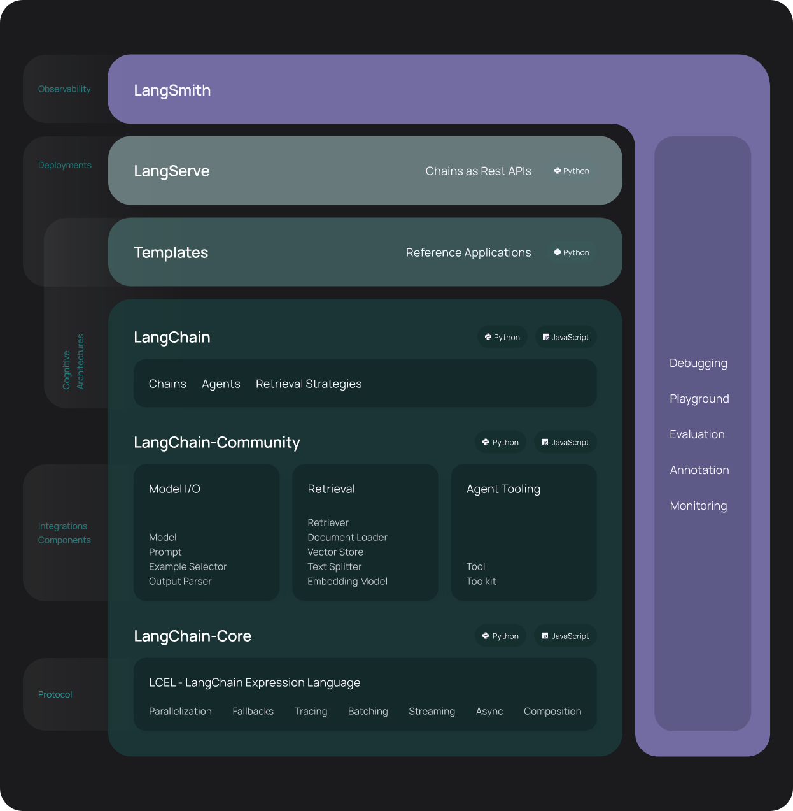

## Review from Last Meeting 

- Go over the Article class from the last meeting
- Test it out by creating an instance and calling each of its methods

## LangChain Intro

- Single-mode LLMs are models that take text as input and inference text as output, within some context window
- We want information to persist between model inferences, and we want each input to contain relevant information

### What is LangChain?

- LangChain is a Python/JavaScript library for building LLM applications
- LangChain has many, many convenient utilities for working with LLMs

### LangChain Q&A with RAG?

- Q&A: Question and Answering, chatbots which have a persistant history
- RAG: Retrieval Augmented Generation, giving LLMs relevant information

## Using LangChain for Article Q&A

- Sample workflow for Q&A with a news article is given in `code/langchain-rag-qa`
- This is what we're going to be working towards, but it's not important to understand every step yet

## Create a LangChain Conda Env

- `brew install conda`
- `conda create -n langchain`
- `conda activate langchain`
- pip install as instructed in the langchain quickstart

## Goals

- Work through the [quickstart](https://python.langchain.com/docs/get_started/quickstart), and choose to use LocalLLMs (this will require `ollama serve` to be running in the background)
- Modify our `Article` class with a class method that uses a simple LangChain invoke to determine if an expert is referenced in an article
- If you have time, explore the other [document loaders](https://python.langchain.com/docs/integrations/document_loaders) that LangChain offers